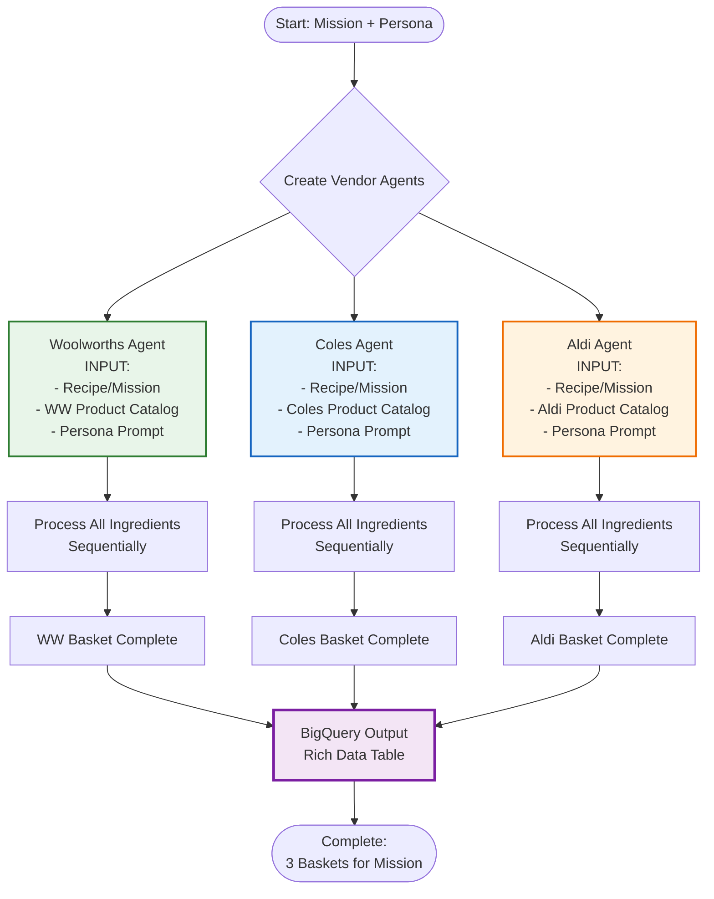
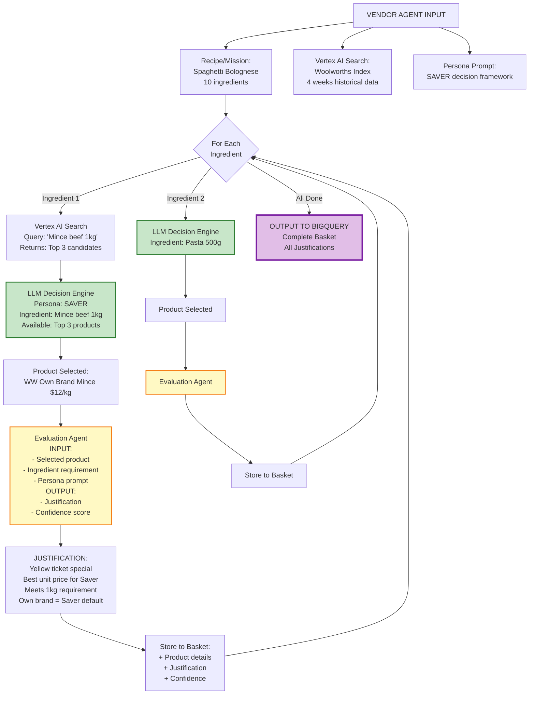
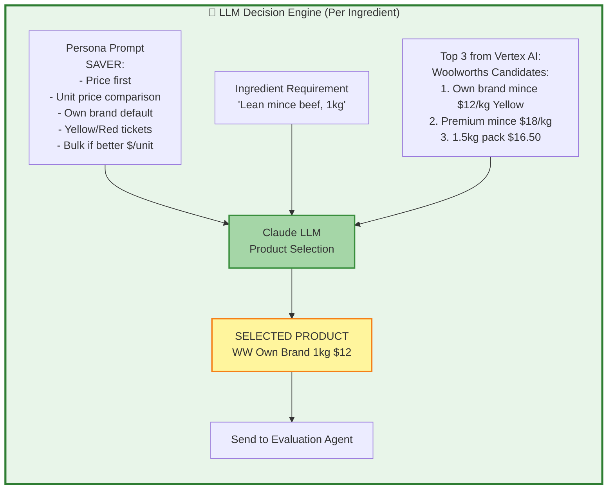
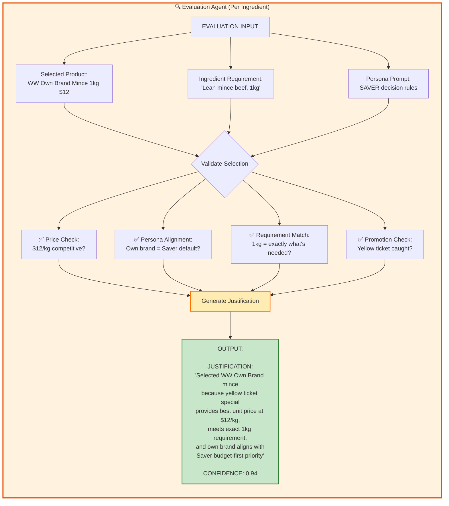
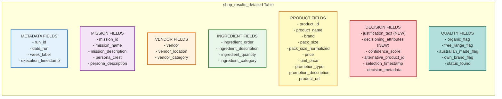
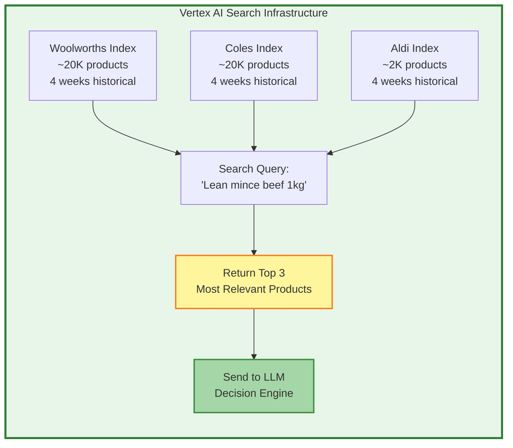
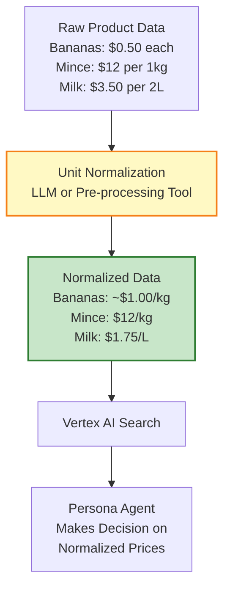

# Mystery Shopping Agent Architecture - REVISED Design

**Created:** May 5, 2026  
**Last Updated:** May 6, 2026  
**Status:** Current Architecture

---

## Executive Summary

**Architecture:** Per-vendor agents with ingredient-level evaluation and justification.

**Key Flow:**
1. **Vendor Agent** (one per retailer: WW, Coles, Aldi)
2. **Vertex AI Search** retrieves top 3 candidate products per ingredient
3. **LLM with Persona Prompt** makes product decisions from top 3
4. **Evaluation Agent** provides justification per ingredient
5. **Rich Output to BigQuery** with full traceability and decisioning attributes

**Recent Changes (May 6):**
- Switched to Vertex AI Search for all retailers (was local embedding for Coles/Aldi)
- Top 3 products per ingredient (was 5)
- Output schema enriched with justification text and decisioning attributes
- Unit normalization pre-processing (planned)

---

## High-Level Architecture



---

## Detailed Per-Vendor Agent Flow

### Single Vendor Agent (e.g., Woolworths)



---

## LLM Decision Engine Detail

### How Product Selection Works



---

## Evaluation Agent Detail

### Per-Ingredient Justification



---

## Complete Data Flow

### From Mission to BigQuery

```mermaid
flowchart TD
    Mission[MISSION:<br/>Spaghetti Bolognese<br/>Persona: SAVER<br/>Date: 2026-05-10] --> Process{Process<br/>3 Vendors}
    
    %% Woolworths
    Process --> WW[WOOLWORTHS AGENT]
    WW --> WWIng1[Ingredient 1: Mince<br/>LLM → Select product<br/>Eval → Justify]
    WWIng1 --> WWIng2[Ingredient 2: Pasta<br/>LLM → Select product<br/>Eval → Justify]
    WWIng2 --> WWIng3[... 10 ingredients ...]
    WWIng3 --> WWBasket[Woolworths Basket Complete]
    
    %% Coles
    Process --> Coles[COLES AGENT]
    Coles --> ColesIng1[Ingredient 1: Mince<br/>LLM → Select product<br/>Eval → Justify]
    ColesIng1 --> ColesIng2[Ingredient 2: Pasta<br/>LLM → Select product<br/>Eval → Justify]
    ColesIng2 --> ColesIng3[... 10 ingredients ...]
    ColesIng3 --> ColesBasket[Coles Basket Complete]
    
    %% Aldi
    Process --> Aldi[ALDI AGENT]
    Aldi --> AldiIng1[Ingredient 1: Mince<br/>LLM → Select product<br/>Eval → Justify]
    AldiIng1 --> AldiIng2[Ingredient 2: Pasta<br/>LLM → Select product<br/>Eval → Justify]
    AldiIng2 --> AldiIng3[... 10 ingredients ...]
    AldiIng3 --> AldiBasket[Aldi Basket Complete]
    
    %% BigQuery Output
    WWBasket --> BQ[BIGQUERY TABLE]
    ColesBasket --> BQ
    AldiBasket --> BQ
    
    BQ --> Data[RICH DATA OUTPUT:<br/>- date_run: 2026-05-10<br/>- crest_persona: SAVER<br/>- recipe: Spaghetti Bolognese<br/>- vendor: Woolworths/Coles/Aldi<br/>- ingredient: Mince beef 1kg<br/>- product_id: WW123456<br/>- product_name: WW Own Brand Mince<br/>- price: $12.00<br/>- unit_price: $12/kg<br/>- unit_normalized: $12/kg (NEW)<br/>- promotion: Yellow Ticket<br/>- justification_text: 'Selected because...' (NEW)<br/>- decisioning_attributes: JSON (NEW)<br/>- confidence: 0.94<br/>... 30 rows total for this mission]
    
    style WW fill:#e8f5e9,stroke:#2e7d32,stroke-width:2px
    style Coles fill:#e3f2fd,stroke:#1565c0,stroke-width:2px
    style Aldi fill:#fff3e0,stroke:#ef6c00,stroke-width:2px
    style BQ fill:#f3e5f5,stroke:#7b1fa2,stroke-width:3px
    style Data fill:#e1bee7,stroke:#6a1b9a,stroke-width:3px
```

---

## BigQuery Output Schema

### Rich Data Table Structure



---

## Vertex AI Search Architecture (NEW - May 6, 2026)

### Search Strategy

**Decision:** Use Vertex AI Search for all three retailers to improve accuracy.

**Rationale:**
- Issue identified: Simple keyword search returned irrelevant results (e.g., "chicken breast bulk pack" → "nuggets")
- Solution: Vertex AI Search provides semantic search with better ingredient matching
- Applies to: Woolworths, Coles, and Aldi

**Implementation:**


**Index Configuration:**
- Index count: TBD (awaiting decision on per-retailer vs per-week indexing)
- Historical scope: 4 weeks
- Product selection: Top 3 candidates per ingredient
- Refresh strategy: Weekly

---

## Unit Normalization Pre-Processing (PLANNED)

### Challenge

Products sold in different units (e.g., bananas sold "each" vs required "1 kilogram") require price normalization for fair comparison.

### Solution (In Development)

**Pre-processing step** to normalize units BEFORE sending to persona agent:



**Approach Options:**
1. LLM-based normalization call (flexible, handles edge cases)
2. Rule-based pre-processing tool (faster, deterministic)
3. Hybrid (rules + LLM fallback)

**Status:** Planning phase - implementation approach TBD

**Action Item:** Alexa to develop normalization solution using existing data frame in B data test location

---

## Recent Architecture Changes

### May 6, 2026 Updates

**Search Strategy:**
- ✅ **CHANGED:** Local embedding → Vertex AI Search for all retailers
- ✅ **CHANGED:** Top 5 products → Top 3 products
- **Reason:** Improved accuracy for ingredient matching

**Output Schema:**
- ✅ **ADDED:** `justification_text` field for decision transparency
- ✅ **ADDED:** `decisioning_attributes` JSON field for all attributes used in decision
- ✅ **PLANNED:** `unit_normalized` field for price comparisons

**Data Pipeline:**
- ✅ **CONFIRMED:** 4 weeks historical data (12 weeks technically available)
- ✅ **PLANNED:** Unit normalization pre-processing step

**Testing:**
- ✅ Use 'parallel agents' branch for testing (main branch deprecated)
- ✅ Test location: `cd app` directory
