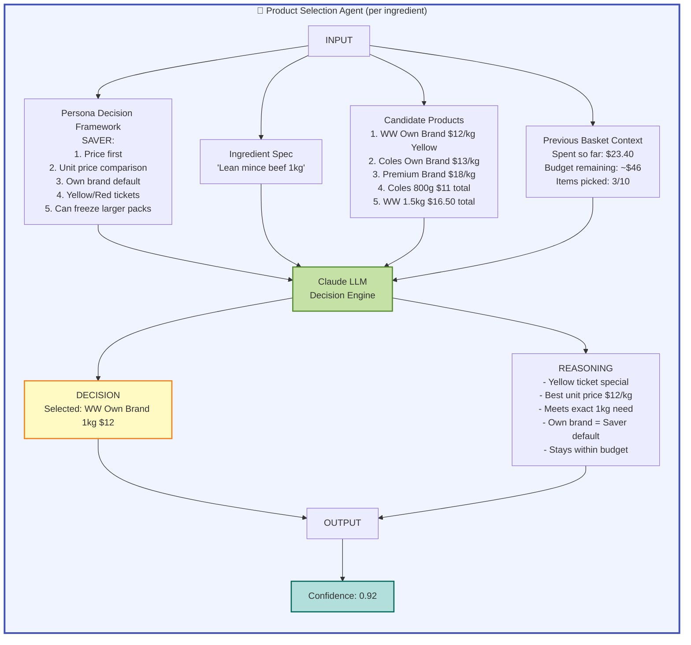
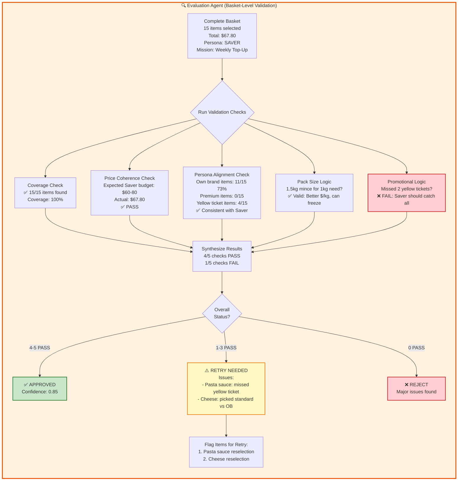
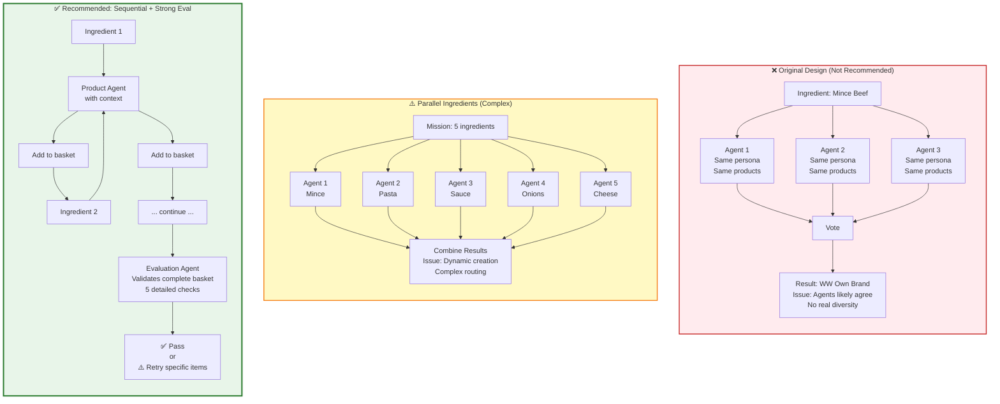

# Mystery Shopping Agent Architecture - Optimal Design

**Created:** May 5, 2026  
**Status:** Recommended Architecture  
**Context:** Design review following May 5 standup discussion

---

## Executive Summary

**Recommended Approach:** Sequential product selection with strong basket-level evaluation agent.

**Key Decision:** Prioritize delivery certainty over theoretical performance gains for May 18 board demo.

**Why Sequential Over Parallel:**
- ✅ Latency is NOT a bottleneck (weekly batch processing, 120 shops)
- ✅ Simpler implementation with 2 weeks to demo
- ✅ Easier debugging and error handling
- ✅ Context carryover between ingredient selections
- ✅ Can optimize to parallel post-demo if needed

---

## Architecture Overview

### Main Sequential Flow

```mermaid
flowchart TD
    Start([Start Mission]) --> LoadPersona[Load Persona Context<br/>Saver, Traditional, etc.]
    LoadPersona --> InitBasket[Initialize Empty Basket<br/>basket = []]
    
    InitBasket --> LoopStart{More<br/>Ingredients?}
    
    %% Sequential Ingredient Processing
    LoopStart -->|Yes| GetIngredient[Get Next Ingredient<br/>e.g., 'Mince beef 1kg']
    
    GetIngredient --> RAG[RAG Retrieval System<br/>Query BigQuery for candidates]
    RAG --> RAGDetails[Return Top 10-15 Products<br/>- Woolworths options<br/>- Coles options<br/>- Aldi options<br/>with prices, promos, attributes]
    
    RAGDetails --> ProductAgent[Product Selection Agent<br/>INPUT:<br/>- Persona prompt<br/>- Ingredient description<br/>- Candidate products<br/>- Previous basket context]
    
    ProductAgent --> AgentDecision[Agent Decision<br/>Selected: WW Own Brand Mince $12/kg<br/>Reasoning: Yellow ticket, meets 1kg,<br/>best unit price for Saver]
    
    AgentDecision --> AddToBasket[Add to Basket<br/>basket.append]
    AddToBasket --> LoopStart
    
    %% Evaluation Phase
    LoopStart -->|No - All done| EvalAgent[Evaluation Agent<br/>Basket-Level Validation]
    
    EvalAgent --> Check1{Coverage Check<br/>All items found?}
    Check1 -->|Fail| FailReasons
    Check1 -->|Pass| Check2
    
    Check2{Persona Alignment<br/>Picks match Saver?}
    Check2 -->|Fail| FailReasons
    Check2 -->|Pass| Check3
    
    Check3{Price Coherence<br/>Budget reasonable?}
    Check3 -->|Fail| FailReasons
    Check3 -->|Pass| Check4
    
    Check4{Pack Size Logic<br/>Quantities sensible?}
    Check4 -->|Fail| FailReasons
    Check4 -->|Pass| Check5
    
    Check5{Promo Alignment<br/>Saver caught specials?}
    Check5 -->|Fail| FailReasons
    Check5 -->|Pass| Success
    
    %% Retry Logic
    FailReasons[Identify Problem Items<br/>e.g., Premium mince inconsistent] --> RetryCount{Retry Count<br/>< 3?}
    
    RetryCount -->|Yes| RetryLogic[Smart Retry<br/>- Stricter price filters<br/>- Emphasized persona prompt<br/>- Different search terms]
    
    RetryLogic --> ReRAG[Re-run RAG for<br/>Problem Ingredients Only]
    ReRAG --> ProductAgent
    
    RetryCount -->|No| ManualFlag[Flag for Manual Review<br/>Low confidence warning]
    ManualFlag --> SaveResults
    
    %% Success Path
    Success[✅ Validation PASSED] --> SaveResults[Save to BigQuery<br/>shop_results table<br/>basket_summaries table]
    
    SaveResults --> NextMission{More<br/>Missions?}
    NextMission -->|Yes| Start
    NextMission -->|No| Complete([Complete<br/>120 Shops Done])
    
    %% Styling
    classDef personaStyle fill:#e1f5ff,stroke:#0066cc,stroke-width:2px
    classDef ragStyle fill:#fff4e1,stroke:#ff9900,stroke-width:2px
    classDef agentStyle fill:#e8f5e9,stroke:#2e7d32,stroke-width:2px
    classDef evalStyle fill:#fce4ec,stroke:#c2185b,stroke-width:2px
    classDef successStyle fill:#c8e6c9,stroke:#388e3c,stroke-width:3px
    classDef failStyle fill:#ffcdd2,stroke:#d32f2f,stroke-width:2px
    
    class LoadPersona,InitBasket personaStyle
    class RAG,RAGDetails,ReRAG ragStyle
    class ProductAgent,AgentDecision agentStyle
    class EvalAgent,Check1,Check2,Check3,Check4,Check5 evalStyle
    class Success successStyle
    class FailReasons,ManualFlag failStyle
```

---

## Product Selection Agent Detail

### How Each Ingredient is Processed



**Key Innovation: Context Carryover**

Unlike parallel processing, sequential allows the agent to consider:
- Budget spent so far
- Product tier consistency (if picked premium protein, adjust expectations)
- Promotional strategy (already got 2 yellow tickets, prioritize coverage now)

This mirrors **real human shopping behavior** - adjusting later picks based on earlier ones.

---

## Evaluation Agent Detail

### Basket-Level Validation



### Five Validation Checks

| Check | Purpose | Example Failure | Retry Strategy |
|-------|---------|-----------------|----------------|
| **Coverage** | All items found? | Only 12/15 items = 80% | Broaden search terms, relax filters |
| **Price Coherence** | Total within expected budget? | Saver basket $120 (expected $60-80) | Re-select expensive items with stricter price caps |
| **Persona Alignment** | Picks match persona behavior? | Saver picked 8/15 premium items | Re-emphasize persona prompt, filter premium |
| **Pack Size Logic** | Quantities make sense? | Bought 5kg mince for 1kg need without freezer mention | Check persona logic on bulk buying |
| **Promotional Logic** | Caught relevant promotions? | Saver missed 3 yellow tickets | Re-run with promotion emphasis |

---

## Architecture Comparison

### Why Sequential Wins for Your Use Case



---

## Performance Analysis

### Latency Comparison

| Approach | Time per Mission | 120 Shops Total | Complexity |
|----------|------------------|-----------------|------------|
| **Original 3-Agent Vote** | ~45-60s | ~90-120 min | Medium (voting overhead) |
| **Parallel Ingredients** | ~20-30s | ~40-60 min | **High** (dynamic routing) |
| **Sequential (Recommended)** | ~60-90s | ~120-180 min | **Low** (simple flow) |

### Why Latency Doesn't Matter

**Production Schedule:**
- Runs **weekly** (Friday 10 AM AEST)
- Not user-facing real-time
- 2-3 hours total execution time = acceptable for batch processing

**Board Demo:**
- Pre-run all 120 shops
- Show **results** in dashboard
- Not live execution

**When You'd Need Parallel:**
- Real-time demo (<30s response)
- Daily execution (10x load)
- Live board member interaction

---

## Implementation Pseudocode

### Sequential Product Selection

```python
def execute_mission(mission, persona, retailer):
    """
    Execute a single shopping mission for a persona at a retailer.
    
    Args:
        mission: Mission object with ingredients list
        persona: Persona object (Saver, Traditional, etc.)
        retailer: Retailer name (Woolworths, Coles, Aldi)
    
    Returns:
        Basket object with selected products and metadata
    """
    basket = Basket(mission=mission, persona=persona, retailer=retailer)
    persona_context = load_persona_prompt(persona.name)
    retry_count = 0
    max_retries = 3
    
    # Sequential ingredient processing
    for ingredient in mission.ingredients:
        # RAG retrieval
        candidates = rag_search(
            ingredient=ingredient,
            retailer=retailer,
            top_k=15,
            filters={
                'price_range': persona.get_price_range(ingredient),
                'categories': ingredient.categories
            }
        )
        
        # Product selection agent
        selection = product_selection_agent(
            persona=persona_context,
            ingredient=ingredient,
            candidates=candidates,
            previous_basket=basket.items,  # Context carryover
            budget_spent=basket.total_price,
            budget_remaining=persona.get_budget(mission) - basket.total_price
        )
        
        basket.add_item(
            product=selection.product,
            reasoning=selection.reasoning,
            confidence=selection.confidence
        )
    
    # Basket evaluation
    while retry_count < max_retries:
        validation = evaluation_agent(
            persona=persona_context,
            basket=basket,
            mission=mission
        )
        
        if validation.status == "PASS":
            basket.validation_status = "APPROVED"
            basket.confidence = validation.confidence
            break
        
        elif validation.status == "RETRY":
            # Smart retry for problematic items only
            for issue in validation.issues:
                retry_ingredient(
                    basket=basket,
                    ingredient=issue.ingredient,
                    issue_type=issue.type,
                    persona=persona_context
                )
            retry_count += 1
        
        else:  # FAIL
            basket.validation_status = "FAILED"
            basket.flag_for_manual_review(validation.issues)
            break
    
    if retry_count >= max_retries:
        basket.validation_status = "MAX_RETRIES_EXCEEDED"
        basket.flag_for_manual_review()
    
    # Save to BigQuery
    save_to_bigquery(basket)
    
    return basket


def product_selection_agent(persona, ingredient, candidates, 
                            previous_basket, budget_spent, budget_remaining):
    """
    Single agent makes product selection decision.
    
    Key inputs:
    - persona: Full persona prompt with decision framework
    - ingredient: What to buy
    - candidates: Top 10-15 products from RAG
    - previous_basket: Context from earlier picks
    - budget_spent/remaining: Financial awareness
    """
    prompt = f"""
    You are a {persona.name} shopper.
    
    {persona.decision_framework}
    
    INGREDIENT NEEDED:
    {ingredient.description}
    
    AVAILABLE OPTIONS:
    {format_candidates(candidates)}
    
    BASKET CONTEXT:
    - Items selected so far: {len(previous_basket)}
    - Budget spent: ${budget_spent:.2f}
    - Budget remaining: ${budget_remaining:.2f}
    - Previous picks: {summarize_previous_picks(previous_basket)}
    
    Select the best product and explain your reasoning.
    Output format:
    {{
        "product_id": "...",
        "reasoning": "...",
        "confidence": 0.0-1.0
    }}
    """
    
    response = claude_api_call(prompt)
    return parse_selection(response)


def evaluation_agent(persona, basket, mission):
    """
    Validates complete basket against persona expectations.
    
    Runs 5 validation checks:
    1. Coverage (all items found?)
    2. Price coherence (within expected budget?)
    3. Persona alignment (picks match persona behavior?)
    4. Pack size logic (quantities sensible?)
    5. Promotional logic (caught relevant promotions?)
    """
    checks = [
        check_coverage(basket, mission),
        check_price_coherence(basket, persona),
        check_persona_alignment(basket, persona),
        check_pack_size_logic(basket, persona),
        check_promotional_logic(basket, persona)
    ]
    
    passed = sum(1 for check in checks if check.status == "PASS")
    
    if passed >= 4:
        return ValidationResult(status="PASS", confidence=passed/5)
    elif passed >= 1:
        return ValidationResult(
            status="RETRY",
            issues=[c for c in checks if c.status == "FAIL"]
        )
    else:
        return ValidationResult(status="FAIL", issues=checks)
```

---

## When to Parallelize (Future)

### Conditions That Would Justify Parallel Architecture

1. **Latency Requirement Changes**
   - Board members want **live** demo (not pre-run)
   - Need sub-60 second basket completion
   - Real-time user-facing dashboard

2. **Scale Increase**
   - Move from weekly to **daily** execution
   - Expand to 1,000+ shops per run
   - Multiple regions/states simultaneously

3. **Retailer Parallelization** (Different from ingredient parallelization)
   - Run Woolworths, Coles, Aldi **simultaneously** for same mission
   - This IS valuable - true independent work
   - Much simpler than dynamic ingredient parallelization

### Recommended Parallel Strategy (Post-Demo)

**Don't parallelize ingredients → Parallelize retailers**

```python
# Good parallelization
results = await asyncio.gather(
    execute_mission(mission, persona, "Woolworths"),
    execute_mission(mission, persona, "Coles"),
    execute_mission(mission, persona, "Aldi")
)
# Each mission is independent, true parallel work

# Bad parallelization
# Dynamic ingredient-level parallelization
# Complex, error-prone, minimal value given latency tolerance
```

---

## Technical Stack Considerations

### ADK Implementation

**Sequential Flow:**
```python
from anthropic import Anthropic

# Simple sequential agent
class MysteryShopAgent:
    def __init__(self, persona):
        self.client = Anthropic()
        self.persona = persona
        self.basket = []
    
    async def shop(self, mission):
        for ingredient in mission.ingredients:
            selection = await self.select_product(ingredient)
            self.basket.append(selection)
        
        validation = await self.validate_basket()
        return validation
```

**Parallel Flow (More Complex):**
```python
# Requires dynamic agent creation based on ingredient count
# Variable number of parallel agents per mission
# Complex error handling and state management
```

### Why Sequential is Easier for ADK

- Static agent graph (doesn't change per mission)
- Simple state management
- Clear error boundaries
- Straightforward debugging

---

## Decision Log

### May 5, 2026 - Architecture Decision

**Context:** Team debated three approaches during standup
1. Original: 3 agents vote on same ingredient
2. Complex: Parallel agents for different ingredients
3. Sequential: One agent, strong evaluation

**Decision:** **Sequential with strong evaluation agent**

**Rationale:**
- Latency not a requirement (weekly batch, 2-3 hour window acceptable)
- 2 weeks to board demo (delivery certainty > theoretical optimization)
- Simpler debugging and validation
- Context carryover improves decision quality
- Can optimize post-demo if requirements change

**Decision Makers:** Alexa Kelly (stakeholder), Golnaz Vakili (technical review)

**Alternatives Considered:**
- ❌ 3-agent voting: "Overkill" - same LLM, same inputs, minimal diversity
- ⚠️ Parallel ingredients: High complexity, marginal latency benefit

**Future Review:** Post-May 18 if latency becomes requirement

---

## Success Metrics

### System Performance Targets

| Metric | Target | Measurement |
|--------|--------|-------------|
| **Coverage** | >95% | Items found / items requested |
| **Price Accuracy** | >98% within $0.50 | Basket price vs. API validation |
| **Persona Alignment** | >90% validation pass rate | Evaluation agent approval rate |
| **Execution Time** | <5 min per mission | Average time for 15-item basket |
| **Confidence Score** | >0.80 average | Agent self-reported confidence |

### Quality Indicators

- **Own Brand Ratio by Persona:**
  - Saver: 70%+ own brand
  - Essential: 80%+ own brand
  - Traditional: <30% own brand
  - Refined: <10% own brand

- **Promotional Capture:**
  - Saver: Should catch >90% of yellow tickets
  - Traditional: 40-50% promotional engagement
  - Refined: <20% promotion-driven picks

---

## References

- [PROJECT_BRIEF.md](../../PROJECT_BRIEF.md) - Original multi-agent voting architecture
- [Persona Files](../../config/personas/) - CREST persona decision frameworks
- [May 5 Standup](../../meetings/standup%20may5.txt) - Design discussion transcript

---

**Last Updated:** May 5, 2026  
**Status:** Approved for Implementation  
**Next Review:** Post-May 18 Board Demo
