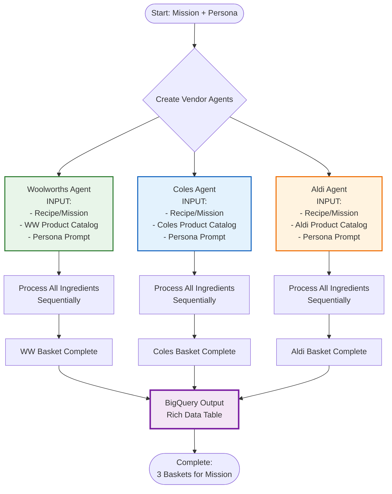
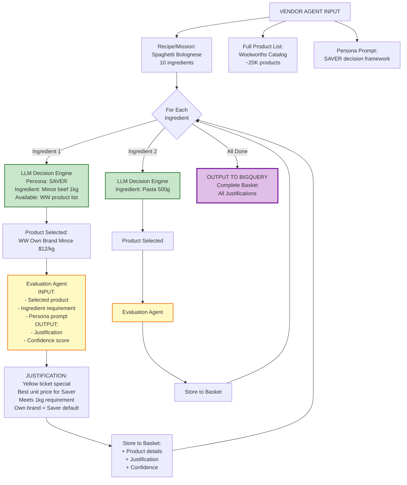
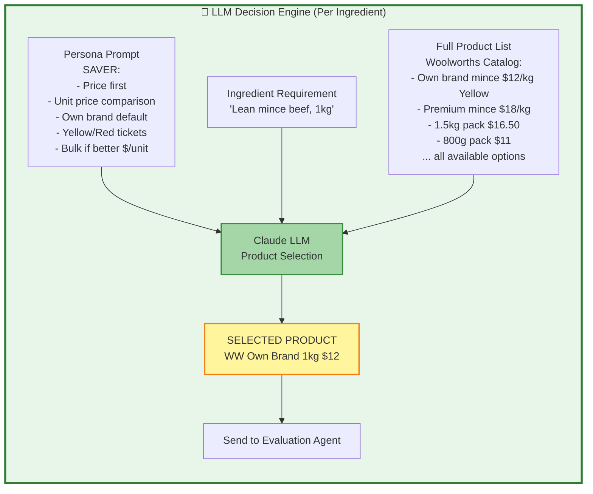
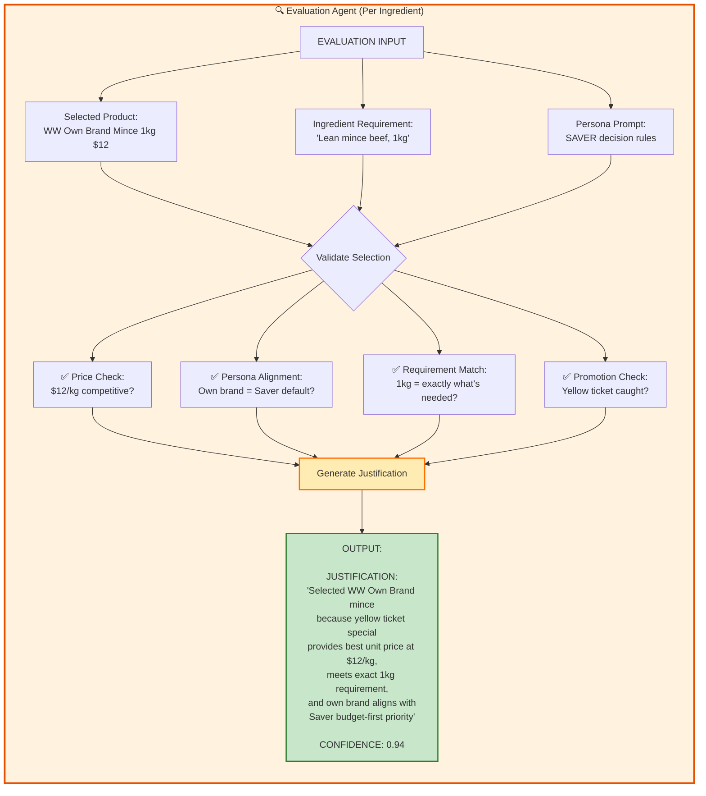
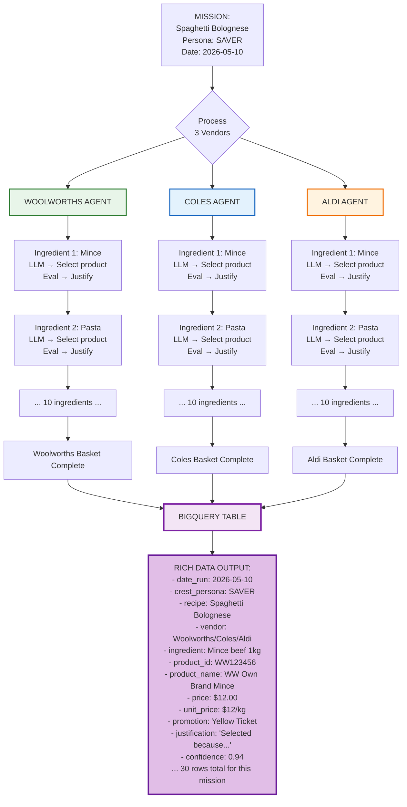

# Mystery Shopping Agent Architecture - REVISED Design

**Updated:** May 5, 2026 (Post-Catchup)  
**Status:** Current Architecture  
**Previous Version:** AGENT_ARCHITECTURE_DESIGN.md

---

## Executive Summary

**Architecture:** Per-vendor agents with ingredient-level evaluation and justification.

**Key Flow:**
1. **Vendor Agent** (one per retailer: WW, Coles, Aldi)
2. **Recipe + Full Product List** as input
3. **LLM with Persona Prompt** makes product decisions
4. **Evaluation Agent** provides justification per ingredient
5. **Rich Output to BigQuery** with full traceability

---

## High-Level Architecture



---

## Detailed Per-Vendor Agent Flow

### Single Vendor Agent (e.g., Woolworths)



---

## LLM Decision Engine Detail

### How Product Selection Works



---

## Evaluation Agent Detail

### Per-Ingredient Justification



---

## Complete Data Flow

### From Mission to BigQuery



---

## BigQuery Output Schema

### Rich Data Table Structure

```mermaid
graph TD
    subgraph BigQueryTable["shop_results_detailed Table"]
        direction TB
        
        Meta[METADATA FIELDS<br/>- run_id<br/>- date_run<br/>- week_label<br/>- execution_timestamp]
        
        Mission[MISSION FIELDS<br/>- mission_id<br/>- mission_name<br/>- mission_description<br/>- persona (CREST)<br/>- persona_description]
        
        Vendor[VENDOR FIELDS<br/>- vendor<br/>- vendor_location<br/>- vendor_category]
        
        Ingredient[INGREDIENT FIELDS<br/>- ingredient_order<br/>- ingredient_description<br/>- ingredient_quantity<br/>- ingredient_category]
        
        Product[PRODUCT FIELDS<br/>- product_id<br/>- product_name<br/>- brand<br/>- pack_size<br/>- pack_size_normalized<br/>- price<br/>- unit_price<br/>- promotion_type<br/>- promotion_description<br/>- product_url]
        
        Decision[DECISION FIELDS<br/>- justification (LLM reasoning)<br/>- confidence_score<br/>- alternative_product_id<br/>- selection_timestamp]
        
        Quality[QUALITY FIELDS<br/>- organic_flag<br/>- free_range_flag<br/>- australian_made_flag<br/>- own_brand_flag<br/>- status (found/not_found)]
    end
    
    style Meta fill:#e3f2fd,stroke:#1565c0,stroke-width:2px
    style Mission fill:#f3e5f5,stroke:#7b1fa2,stroke-width:2px
    style Vendor fill:#fff3e0,stroke:#ef6c00,stroke-width:2px
    style Ingredient fill:#e8f5e9,stroke:#2e7d32,stroke-width:2px
    style Product fill:#fff9c4,stroke:#f57f17,stroke-width:2px
    style Decision fill:#ffcdd2,stroke:#c62828,stroke-width:2px
    style Quality fill:#b2dfdb,stroke:#00695c,stroke-width:2px
```

---

## Implementation Pseudocode

### Vendor Agent

```python
class VendorAgent:
    """
    Agent for a single vendor (Woolworths, Coles, or Aldi).
    Processes all ingredients for a mission.
    """
    
    def __init__(self, vendor_name, product_catalog, persona):
        self.vendor = vendor_name
        self.products = product_catalog  # Full catalog for this vendor
        self.persona = persona
        self.llm = Claude()
        self.eval_agent = EvaluationAgent(persona)
    
    def process_mission(self, mission):
        """
        Process all ingredients in a mission/recipe.
        
        Args:
            mission: Mission object with ingredients list
        
        Returns:
            Complete basket with justifications
        """
        basket = []
        
        for ingredient in mission.ingredients:
            # LLM makes product selection
            selected_product = self.select_product(ingredient)
            
            # Evaluation agent provides justification
            justification = self.eval_agent.justify_selection(
                selected_product=selected_product,
                ingredient=ingredient,
                persona=self.persona
            )
            
            # Store result
            basket.append({
                'vendor': self.vendor,
                'ingredient': ingredient,
                'product': selected_product,
                'justification': justification.text,
                'confidence': justification.confidence,
                'timestamp': datetime.now()
            })
        
        return basket
    
    def select_product(self, ingredient):
        """
        LLM selects best product for ingredient given persona.
        
        Args:
            ingredient: Ingredient specification (e.g., "Mince beef 1kg")
        
        Returns:
            Selected product from catalog
        """
        prompt = f"""
        You are a {self.persona.name} shopper at {self.vendor}.
        
        PERSONA DECISION FRAMEWORK:
        {self.persona.decision_framework}
        
        INGREDIENT NEEDED:
        {ingredient.description}
        Quantity: {ingredient.quantity}
        
        AVAILABLE PRODUCTS:
        {self.format_product_catalog(ingredient)}
        
        Select the best product that matches your persona's priorities.
        Return the product_id only.
        """
        
        response = self.llm.complete(prompt)
        return self.products.get(response.product_id)
    
    def format_product_catalog(self, ingredient):
        """
        Format relevant products from catalog for LLM.
        Filters by category, sorts by relevance.
        """
        relevant_products = self.products.filter(
            category=ingredient.category,
            # Could add more filters here
        )
        
        # Return formatted list with all details
        return "\n".join([
            f"- {p.id}: {p.name} | {p.brand} | {p.pack_size} | "
            f"${p.price} ({p.unit_price}) | "
            f"{'YELLOW TICKET' if p.promotion == 'yellow' else ''}"
            for p in relevant_products
        ])


class EvaluationAgent:
    """
    Provides justification for product selections.
    Validates alignment with persona and requirements.
    """
    
    def __init__(self, persona):
        self.persona = persona
        self.llm = Claude()
    
    def justify_selection(self, selected_product, ingredient, persona):
        """
        Generate justification for why product was selected.
        
        Args:
            selected_product: The product that was selected
            ingredient: What was required
            persona: Shopping persona
        
        Returns:
            Justification object with text and confidence
        """
        prompt = f"""
        A {persona.name} shopper selected this product:
        
        SELECTED: {selected_product.name}
        - Brand: {selected_product.brand}
        - Price: ${selected_product.price}
        - Unit Price: {selected_product.unit_price}
        - Pack Size: {selected_product.pack_size}
        - Promotion: {selected_product.promotion or 'None'}
        
        FOR INGREDIENT: {ingredient.description}
        
        PERSONA RULES:
        {persona.decision_framework}
        
        Provide a clear justification for why this product aligns with 
        the {persona.name} persona's priorities. Also assess confidence (0-1).
        
        Output format:
        {{
            "justification": "Selected because...",
            "confidence": 0.0-1.0,
            "checks": {{
                "price_appropriate": true/false,
                "persona_aligned": true/false,
                "requirement_met": true/false,
                "promotion_considered": true/false
            }}
        }}
        """
        
        response = self.llm.complete(prompt)
        return Justification(
            text=response.justification,
            confidence=response.confidence,
            checks=response.checks
        )


# Main execution flow
def run_mystery_shop(mission, persona, date_run):
    """
    Execute mystery shop for all vendors.
    
    Args:
        mission: Mission/recipe to shop
        persona: CREST persona (Saver, Traditional, etc.)
        date_run: Date of execution
    
    Returns:
        Combined results from all vendors
    """
    # Initialize vendor agents
    woolworths_agent = VendorAgent(
        vendor_name="Woolworths",
        product_catalog=load_woolworths_catalog(),
        persona=persona
    )
    
    coles_agent = VendorAgent(
        vendor_name="Coles",
        product_catalog=load_coles_catalog(),
        persona=persona
    )
    
    aldi_agent = VendorAgent(
        vendor_name="Aldi",
        product_catalog=load_aldi_catalog(),
        persona=persona
    )
    
    # Process mission at all vendors (can be parallel)
    results = []
    
    for agent in [woolworths_agent, coles_agent, aldi_agent]:
        basket = agent.process_mission(mission)
        
        # Add metadata
        for item in basket:
            item.update({
                'run_id': generate_run_id(),
                'date_run': date_run,
                'mission_name': mission.name,
                'persona': persona.name,
                'persona_description': persona.description
            })
        
        results.extend(basket)
    
    # Output to BigQuery
    save_to_bigquery(results, table='shop_results_detailed')
    
    return results
```

---

## Example Output Record

### Single Ingredient Result in BigQuery

```json
{
  "run_id": "run_20260510_001",
  "date_run": "2026-05-10",
  "week_label": "Week 1 May 2026",
  "execution_timestamp": "2026-05-10T10:15:32Z",
  
  "mission_id": "mission_001",
  "mission_name": "Spaghetti Bolognese",
  "mission_description": "Traditional family meal for 4",
  "persona": "SAVER",
  "persona_description": "Budget-conscious young families",
  
  "vendor": "Woolworths",
  "vendor_location": "Mascot CFC",
  "vendor_category": "Supermarket",
  
  "ingredient_order": 1,
  "ingredient_description": "Lean mince beef, 1kg",
  "ingredient_quantity": "1kg",
  "ingredient_category": "Meat",
  
  "product_id": "WW_123456",
  "product_name": "Woolworths Lean Beef Mince",
  "brand": "Woolworths",
  "pack_size": "1kg",
  "pack_size_normalized": 1000,
  "price": 12.00,
  "unit_price": "$12.00/kg",
  "promotion_type": "yellow_ticket",
  "promotion_description": "Special - Save $3",
  "product_url": "https://www.woolworths.com.au/...",
  
  "justification": "Selected Woolworths own brand mince because yellow ticket special provides best unit price at $12/kg (down from $15), meets exact 1kg requirement without waste, and own brand aligns with Saver budget-first priority. Alternative premium brands at $18/kg rejected as inconsistent with price-conscious persona.",
  "confidence_score": 0.94,
  "alternative_product_id": "WW_789012",
  "selection_timestamp": "2026-05-10T10:15:28Z",
  
  "organic_flag": false,
  "free_range_flag": false,
  "australian_made_flag": true,
  "own_brand_flag": true,
  "status": "found"
}
```

---

## Key Architecture Benefits

### Why This Design Works

| Feature | Benefit |
|---------|---------|
| **Per-Vendor Agents** | Clean separation, parallel processing possible |
| **Full Product Catalog Input** | LLM has complete context to make best choice |
| **Ingredient-Level Evaluation** | Rich justification for every decision |
| **Persona Prompt Injection** | Consistent decision-making aligned with CREST segments |
| **Rich BigQuery Output** | Complete traceability and analysis capability |

### Comparison to Previous Design

| Aspect | Previous Design | Current Design |
|--------|----------------|----------------|
| **Agent Scope** | Per-ingredient voting | Per-vendor, all ingredients |
| **Evaluation** | Basket-level only | Per-ingredient justification |
| **Product Context** | RAG top-15 candidates | Full vendor catalog |
| **Output Granularity** | Basket summaries | Ingredient-level detail |
| **Traceability** | Moderate | **High** - full justifications |

---

## Execution Schedule

### Weekly Batch Processing

```mermaid
gantt
    title Weekly Mystery Shop Execution
    dateFormat HH:mm
    section Friday 10 AM
    Load Catalogs         :done, 10:00, 10m
    Mission 1 (8x3=24 shops)  :active, 10:10, 20m
    Mission 2 (8x3=24 shops)  :10:30, 20m
    Mission 3 (8x3=24 shops)  :10:50, 20m
    Mission 4 (8x3=24 shops)  :11:10, 20m
    Mission 5 (8x3=24 shops)  :11:30, 20m
    Mission 6 (8x3=24 shops)  :11:50, 20m
    Mission 7 (8x3=24 shops)  :12:10, 20m
    Mission 8 (8x3=24 shops)  :12:30, 20m
    Save to BigQuery      :12:50, 10m
    section Complete
    120 Shops Done        :milestone, 13:00, 0m
```



**Total Time:** ~3 hours for 120 shops (8 missions × 5 personas × 3 vendors)

---

## Next Steps

1. ✅ **Implement VendorAgent class** with LLM integration
2. ✅ **Implement EvaluationAgent class** for justifications
3. ✅ **Load full product catalogs** into memory/database
4. ✅ **Define BigQuery schema** with rich fields
5. ✅ **Test with single mission** (e.g., Spaghetti Bolognese, Saver, Woolworths)
6. ✅ **Scale to all 120 combinations**
7. ✅ **Build front-end dashboard** to visualize justifications

---

**Last Updated:** May 5, 2026 (Post-Catchup)  
**Status:** Current Recommended Architecture  
**Supersedes:** AGENT_ARCHITECTURE_DESIGN.md (sequential basket-level approach)
